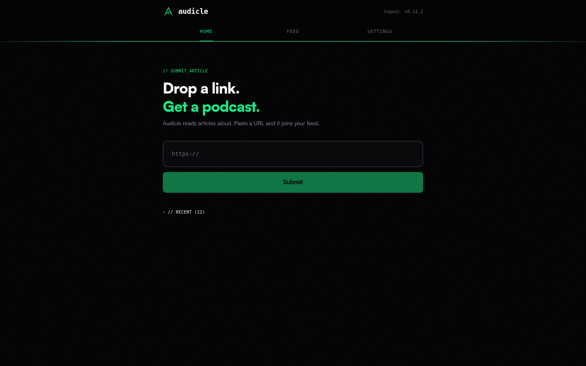
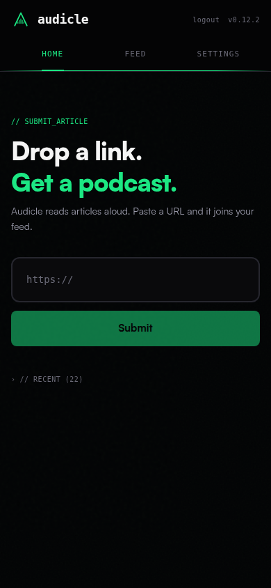
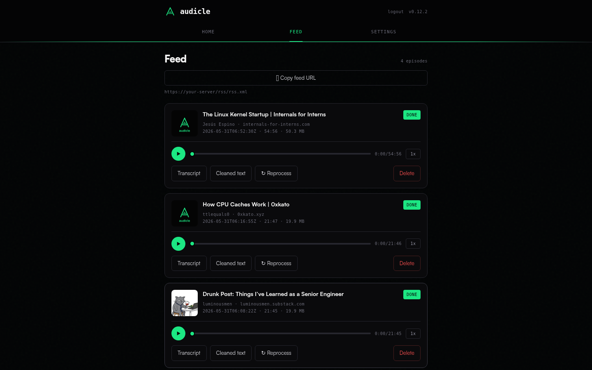
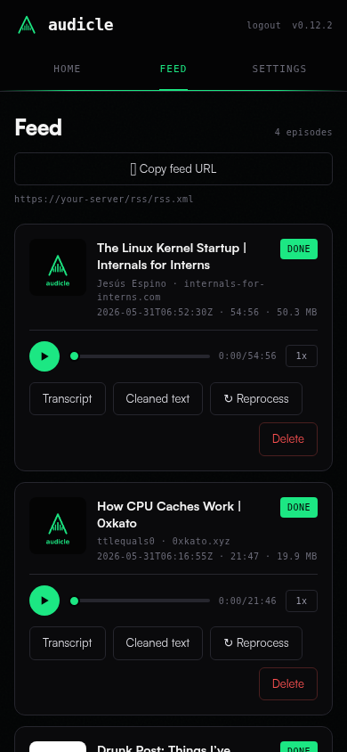
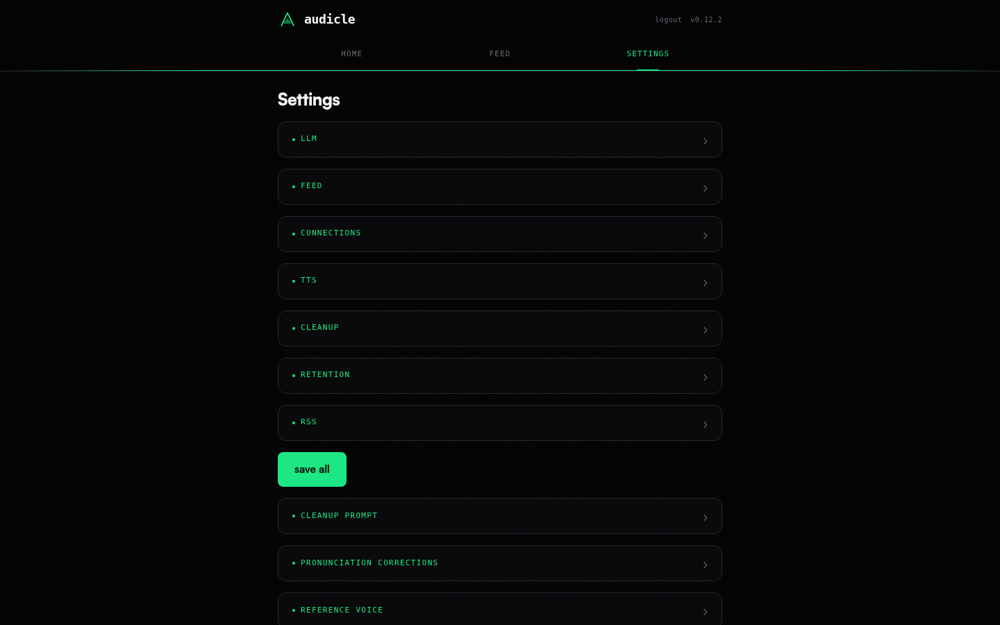
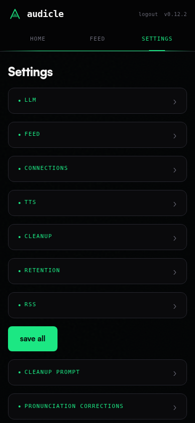

<p align="center">
  
</p>

# Audicle

Self-hosted Podcasting 2.0 service that turns saved articles into a personal podcast feed.

Paste a URL, wait a few minutes, get an episode with cloned-voice narration, artwork, and a WebVTT transcript. Subscribe in Pocket Casts, Overcast, or Apple Podcasts the same way you'd subscribe to anyone else's show.

Tagline: *your reading list, as a podcast you own.*

## Screenshots

Home -- paste a URL and it joins the feed.

<p align="center">
  
  
</p>

Feed -- your episodes with inline players, transcripts, and per-episode actions.

<p align="center">
  
  
</p>

Settings -- provider, voice, prompts, and pronunciation corrections.

<p align="center">
  
  
</p>

## Sample

A 30-second clip of cloned-voice narration (a news article).

https://github.com/user-attachments/assets/4e4e9f05-9da7-4f27-b7e8-41b9dfe1bee3

[Download the MP3](docs/sample.mp3)

## Why

I read too much, I like having my hands free on the go, and the existing "article to audio" tools either lock the audio behind their app, charge per minute, or use voices that sound like airport PA systems. I wanted something that:

- I have full control over
- produces a real podcast feed any podcatcher can subscribe to
- uses my own voice (or any voice I have rights to)
- keeps the source URL list private

That's what this is. If you don't have a GPU, it'll run on CPU too, just slower.

## What's in the repo

```
backend/        FastAPI app, SQLite, the job pipeline
tts-wrapper/    TTS model server (Chatterbox; separate GPU container)
frontend/       React + Tailwind operator UI
data/           runtime artifacts (gitignored: SQLite, MP3, JPG, VTT)
docker-compose.yml
build-plan.md   the design document the implementation tracks against
```

## Quickstart

You need Docker and docker-compose. The app boots unconfigured -- set the LLM
provider/model, feed metadata, admin password, and upload a reference voice from
the Settings UI after it starts (no env or `voice.wav` required up front).

```bash
git clone https://github.com/ttlequals0/Audicle && cd Audicle
cp .env.example .env   # optional: pre-set BASE_URL and any defaults
docker compose up -d
```

The web UI is at `http://localhost:8000/`. The RSS feed lives at a slug derived
from your feed name -- e.g. `FEED_TITLE="Articles of Interest"` is served at
`http://localhost:8000/rss/articles_of_interest.xml`. The Feed page in the UI
shows the exact URL with a copy button; paste it into any podcatcher. Renaming
the feed changes the slug and mints new feed/episode GUIDs, so subscribers
resubscribe to the new URL.

The container runs as a non-root user (uid 1000). If you bind-mount host
directories (or set `user:` in compose), make them writable by uid 1000 so the
app can write the database, media, and seed the default prompt/corrections:

```bash
chown -R 1000:1000 ./data ./backend/app/prompts ./backend/app/corrections ./backend/app/reference
```

If you don't have a CUDA GPU, override the wrapper to use CPU:

```bash
TTS_DEVICE=cpu docker compose up -d
```

First-run model download is ~2 GB and persists on the `./data` volume under
`hf_cache/` and `tts_home/` (the wrapper sets `HF_HOME`/`TTS_HOME` there), so
restarts load from disk instantly.

## Required env vars

| Variable | What it is | Example |
|---|---|---|
| `BASE_URL` | Public-facing URL for the feed and media | `https://podcast.example.com` |
| `FEED_TITLE` | Podcast title | `Drew's reading list` |
| `FEED_AUTHOR` | Author / itunes:author | `Drew K.` |
| `FEED_EMAIL` | Owner email (required by Apple) | `you@example.com` |
| `FEED_CATEGORY` | iTunes category (see list below) | `Technology` |
| `FEED_LANGUAGE` | RFC 5646 tag | `en-US` |
| `FIRECRAWL_URL` | Self-hosted Firecrawl base URL | `http://firecrawl:3002` |
| `FIRECRAWL_API_KEY` | Optional bearer token for a Firecrawl behind auth (blank = open) | _(unset)_ |
| `LLM_PROVIDER` | `openai-compatible`, `anthropic`, `openrouter`, or `ollama` | `openai-compatible` |
| `OPENAI_BASE_URL` | for openai-compatible | `http://llm:8080/v1` |
| `OPENAI_API_KEY` | for openai-compatible | `sk-...` |
| `ANTHROPIC_API_KEY` | for anthropic | `sk-ant-...` |
| `OPENROUTER_API_KEY` | for openrouter (base URL is fixed) | `sk-or-...` |
| `OLLAMA_BASE_URL` | for ollama | `http://host.docker.internal:11434/v1` |
| `SESSION_SECRET_KEY` | Optional session-signing key; auto-generated and persisted to the DB when blank | `openssl rand -hex 32` |
| `SESSION_COOKIE_SECURE` | Require HTTPS for the session cookie; true by default | `false` for localhost dev |

Nothing above is required: the app boots unconfigured and you set operational config (LLM provider/model, feed metadata, connection URLs) and the admin password at runtime in the Settings UI. The admin password is set under Settings > Security (bcrypt hash stored in the DB); until then the app runs in open convenience mode. Full list with defaults lives in `.env.example`. The runtime allowlist (what's editable from the UI without a restart) is enforced in `backend/app/services/runtime_settings.py`.

## Valid iTunes categories

Apple's parser rejects anything not on its list. The current ones (from Apple's RSS spec, May 2026):

```
Arts, Business, Comedy, Education, Fiction, Government, History,
Health & Fitness, Kids & Family, Leisure, Music, News, Religion & Spirituality,
Science, Society & Culture, Sports, Technology, True Crime, TV & Film
```

Subcategories aren't currently surfaced in the UI -- set the top-level category and call it done. If Apple Podcasts shows your feed as "Unknown" after submission, it's almost always a category typo.

## Reference voice

The wrapper conditions on a single short clip you supply. Recommended spec is mono, 24 kHz, 8-12 seconds, around 250 kB to 1 MB. Hard limits enforced by `POST /api/v1/reference/commit` are 3-60 s and <= 5 MB. See `backend/app/reference/README.md` for the sourcing playbook (record yourself, reuse a creative-commons clip, or synthesize one).

Two notes the docs page doesn't repeat:

- The audio quality of the output is mostly determined by the quality of this clip. Cleaning up the source clip (noise reduction, leveling) buys you more than tweaking the TTS knobs.
- The Settings page in the UI lets you upload a candidate, audition it via `POST /api/v1/reference/test`, and commit only if you like it. Skip the audition at your peril.

## Paywalled articles

Some sites hand a scraper only a teaser and hide the rest behind a paywall. That teaser is long enough to look like a real article but turns into a 25-second junk episode. The "article proxy / paywall sites" section in Settings lets you route those hosts through a bypass strategy.

You pick a default strategy and a teaser threshold (the character count below which a matched host is treated as a stub), then list per-site overrides. When a matched host scrapes below the threshold, Audicle retries with the strategy before giving up; if the retry still comes back short, the job fails cleanly instead of narrating the stub. Same thing behind `GET`/`PUT /api/v1/source-fallbacks`.

The strategies:

- `googlebot` (the default): re-fetch the same URL with a Googlebot user agent and a crawler `X-Forwarded-For`. SEO-metered paywalls serve the full article to the crawler, so this is the one that works most often. It runs through the scrape headers, not a separate proxy container.
- `freedium`: rewrite the URL to a Freedium reader proxy. Best for Medium.
- `custom`: rewrite to your own reader-proxy template, any URL containing `{url}`.
- `none`: don't try anything. A matched host that comes back short just fails, which is what you want for a hard paywall you'd rather skip than narrate.

A built-in Medium-to-Freedium rule ships on by default. Your own rules layer on top and win when they collide on a host. The whole thing is gated by `EXTRACTION_FALLBACKS_ENABLED`; set it false to always use the direct scrape.

## Licensing notes

The application code is MIT. A few things downstream of it have their own terms:

- **Chatterbox** is the TTS engine. The `chatterbox-tts` library and its model weights are MIT, so there is no non-commercial restriction on the model itself. Every output does carry Resemble's inaudible PerTh watermark for provenance, and there is no flag to turn it off.
- **Wrapper Python pin**: the wrapper Dockerfile pins Python 3.11, since `chatterbox-tts` caps `numpy<2` below Python 3.13. The backend is separate: it requires Python `>=3.13` and ships on a `python:3.14-slim` image.

The Audicle name and logo are reserved; see `branding/README.md`.

## Architecture

```
        paywall bypass: a matched host's teaser triggers a re-scrape via
        Googlebot / Freedium / a custom proxy (or a clean fail)
        |
        v
URL --> extract (Firecrawl) --> cleanup (LLM) --> corrections (regex)
                                                       |
                                                       v
                                              chunk + TTS (Chatterbox)
                                                       |
                                                       v
                                   quality gate: audio QA + optional
                                   Whisper ASR verify --> regen on fail
                                                       |
                                                       v
                                       audio (ffmpeg) + artwork + VTT
                                                       |
                                                       v
                                          finalize (write DB + RSS)
```

The paywall bypass is operator-configured -- see "Paywalled articles" above.

The chunker self-heals before TTS: it splits run-on sentences that arrive glued together (`end.Next`) and, when a long sentence has no comma or semicolon to break on, falls back to a whitespace split instead of failing the job. Only a single word longer than the character cap is treated as unsplittable.

### TTS verification

Every chunk passes a quality gate before it reaches the audio stage. The signal-level audio analysis catches a take that came back as a flat drone, steady noise, or a repetition; a bad take is regenerated with a fresh seed (Chatterbox is non-deterministic, so a re-gen usually recovers).

You can add a second, optional check: ASR verification. When it is on, the GPU wrapper transcribes each produced chunk with [faster-whisper](https://github.com/SYSTRAN/faster-whisper) and the backend compares that transcript to the text it asked the wrapper to speak. A high word-level divergence means the audio does not say what it should -- dropped content, a hallucinated run, or a leaked preamble -- and the chunk is regenerated on the same budget. The transcription is blind (the expected text is never fed to Whisper as a prompt), so the comparison stays honest.

It is off by default and adds latency per chunk, so it takes two switches: `WHISPER_ENABLED=true` on the wrapper (loads the model) and `WHISPER_VERIFY_ENABLED=true` on the backend (requests and acts on the transcript). The backend half -- enable, divergence threshold, and minimum words -- is operator-tunable live from the Settings page (or `PUT /api/v1/settings`), so you can flip the gate on and adjust strictness without a restart; the wrapper's `WHISPER_ENABLED` stays an env switch since it loads the model at startup. Tune `WHISPER_MODEL` for the accuracy/speed trade. See `.env.example` for the full set.

Two containers: the backend (FastAPI + SQLite) and the TTS wrapper (separate so GPU memory stays isolated and the model only reloads when the voice changes). They share a `/data` volume so the backend can read what the wrapper produces.

There's no message queue. SQLite handles the work queue via a single locked row update -- fine for one or two operators, not the right shape if you ever want to fan out across hosts.

## Operating

- `/health/live` is a flat liveness probe.
- `/health/ready` aggregates DB, ffmpeg, TTS wrapper, Firecrawl, and (optionally) LLM probes. Returns 503 if any check fails.
- `POST /api/v1/purge` removes episodes older than the retention window. Confirmation required.
- Background retention sweep runs from the worker on a fixed cadence -- configurable via `RETENTION_DAYS`.
- Default rate limits are conservative; the `slowapi` middleware wiring lives in `backend/app/main.py`.

If something's broken, start with `/health/ready` -- it tells you which dependency is unhappy. Logs live where docker put them (`docker compose logs app` / `docker compose logs tts-wrapper`).

## Development

Backend:

```bash
uv sync
uv run pytest                              # 386 tests, ~35s
uv run uvicorn app.main:create_app --factory --reload --app-dir backend
```

Frontend:

```bash
cd frontend && npm install && npm run dev   # Vite, hot reload
```

There's an OpenAPI dump at `openapi.yaml`; regenerate via `uv run python scripts/dump_openapi.py`.

CodeQL runs on every PR. Pre-commit hooks aren't installed by default -- wire them with `git config core.hooksPath .githooks` after the `.githooks` directory is in place.

## LLM Disclosure

This project was developed using AI agents as a pair programmer. It was NOT vibe coded. For context, I'm a systems engineer who also writes code professionally with 15+ years of experience. The codebase follows engineering best practices, and all architecture and design decisions were made by me, not by AI. All code generated by LLMs was reviewed and tested by me, a human.

## Credits

The paywall bypass strategies are inspired by [Ladder](https://github.com/everywall/ladder). Audicle doesn't run Ladder or depend on it; the Googlebot fetch is reimplemented natively here as scrape headers. Credit to that project for the technique.
