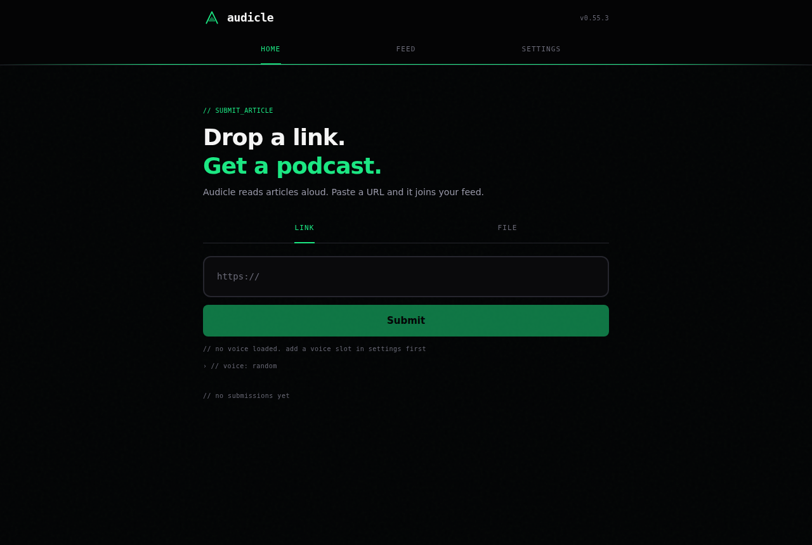
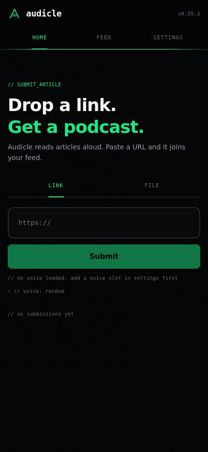
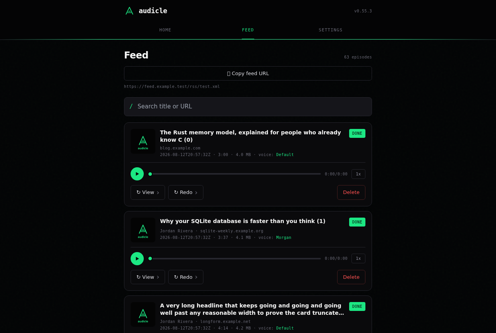
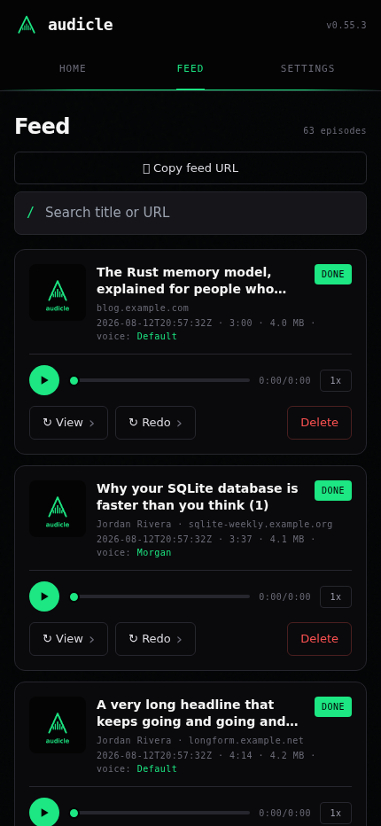
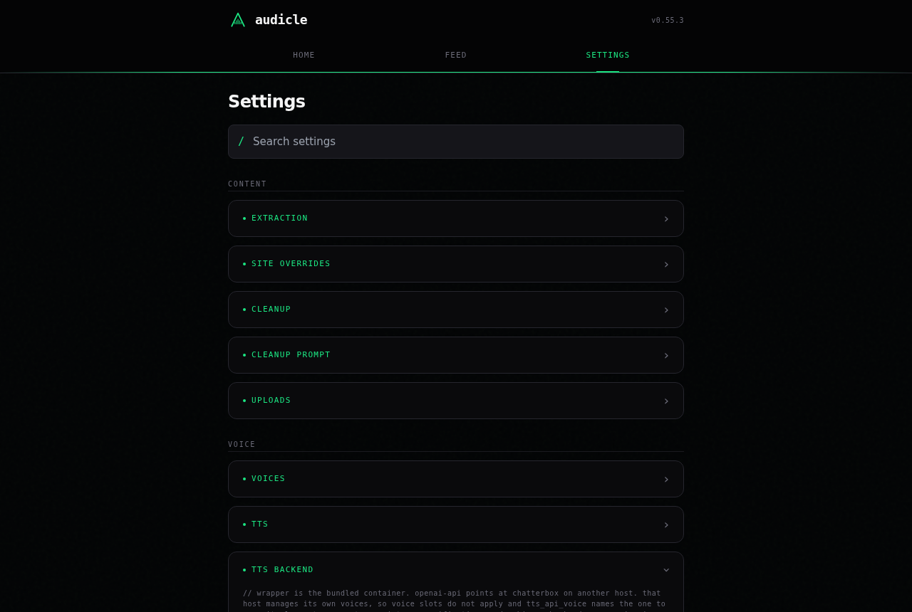
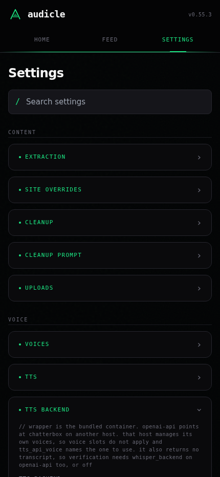

<p align="center">
  
</p>

# Audicle

Self-hosted Podcasting 2.0 service that turns saved articles into a personal podcast feed.

Paste a URL or upload a document (PDF including scanned, DOCX, Markdown, text, HTML, or an image), wait a few minutes, and get an episode with cloned-voice narration, chapters, artwork, an LLM-written episode summary, and a WebVTT transcript. Subscribe in Pocket Casts, Overcast, or Apple Podcasts like any other show.

*Your reading list, as a podcast you own.*

## Why

I read too much, I like my hands free on the go, and the existing article-to-audio tools either lock the audio in their app, charge per minute, or use voices that sound like an airport PA. I wanted something that:

- I control fully
- produces a real podcast feed any podcatcher can subscribe to
- uses my own voice (or any voice I have rights to)
- keeps my reading list private

That's what this is. No GPU? It runs on CPU too, just slower.

## Screenshots

Home: paste a URL or drop files (up to 20 at once), and they join the feed.

<p align="center">
  
  
</p>

Feed: search and page through your episodes, with inline players, transcripts, and per-episode actions.

<p align="center">
  
  
</p>

Settings: everything grouped by subject, searchable as you type.

<p align="center">
  
  
</p>

## Sample

A 30-second clip of cloned-voice narration (a news article).

https://github.com/user-attachments/assets/4e4e9f05-9da7-4f27-b7e8-41b9dfe1bee3

[Download the MP3](docs/sample.mp3)

## Quickstart

You need Docker and docker-compose. The app boots unconfigured: set the LLM provider, feed metadata, and admin password, and upload a reference voice, from the Settings UI after it starts.

```bash
git clone https://github.com/ttlequals0/Audicle && cd Audicle
cp .env.example .env   # compose requires .env to exist; pre-set BASE_URL and any defaults here
docker compose up -d
```

The web UI is at `http://localhost:8000/`, and it installs as a PWA on a phone home screen. The Feed page shows the exact RSS URL to paste into a podcatcher.

Full setup, including CPU-only deployment and file permissions, is in [Installation](docs/installation.md).

## Documentation

The [docs index](docs/README.md) links everything. The short version:

- [How it works](docs/how-it-works.md) - the pipeline, the extraction cascade, and the quality gates that regenerate bad audio
- [Installation](docs/installation.md) and the [web interface](docs/web-interface.md)
- [Configuration](docs/configuration.md) and [every environment variable](docs/environment-variables.md)
- [Voices and TTS](docs/voices-and-tts.md) - voice cloning, and running Chatterbox or Whisper on another host
- [Paywalled articles](docs/paywalls.md) - what happens when a site serves a teaser instead of the article
- [Feeds and Podcasting 2.0](docs/feeds-and-podcasting.md), the [API and webhooks](docs/api-and-webhooks.md), and a [glossary](docs/glossary.md)
- [Releasing](docs/releasing.md) and the [deployment runbook](docs/DEPLOYMENT.md)

## What's in the repo

```
backend/        FastAPI app, SQLite, the job pipeline
tts-wrapper/    TTS model server (Chatterbox; separate GPU container)
render/         full-article render sidecar (Camoufox + xvfb; clicks expand gates)
frontend/       React + Tailwind operator UI
docs/           documentation and screenshots
data/           runtime artifacts (gitignored: SQLite, MP3, JPG, VTT)
docker-compose.yml
```

## Development

Backend:

```bash
uv sync
uv run pytest                              # 1000+ tests, a few minutes
uv run uvicorn app.main:create_app --factory --reload --app-dir backend
```

Frontend:

```bash
cd frontend && npm install && npm run dev   # Vite, hot reload
```

The `tts-wrapper/` and `render/` packages have their own test suites (`uv run pytest` in each). Lint with `uv run ruff check` from the root; one run covers everything. The OpenAPI schema lives at `openapi.yaml`; regenerate it with `uv run python scripts/dump_openapi.py`.

CodeQL runs on every PR through GitHub's default-setup code scanning (there is no in-repo workflow file for it).

## Licensing notes

The application code is MIT. A few things downstream of it have their own terms:

- **Chatterbox** is the TTS engine. The `chatterbox-tts` library and its model weights are MIT, so there's no non-commercial restriction on the model itself. Every output carries Resemble's inaudible PerTh watermark for provenance, with no flag to turn it off.
- **Wrapper Python pin**: the wrapper runs Python 3.11 from its `python:3.11-slim` base with torch 2.6.0 installed from PyPI (the CUDA-enabled cu124 wheel). The Python ceiling tracks `chatterbox-tts`'s `torch==2.6.0` pin. The backend is separate: Python `>=3.13`, shipped on `python:3.14-slim`.

The Audicle name and logo are reserved; see `branding/README.md`.

## LLM Disclosure

This project was developed with AI agents as a pair programmer. It was NOT vibe coded. I'm a systems engineer with 15+ years of professional experience; every architecture and design decision here is mine, not the AI's, and every line the LLMs wrote, I reviewed and tested myself.

## Credits

The paywall bypass strategies are inspired by [Ladder](https://github.com/everywall/ladder); see [Paywalled articles](docs/paywalls.md#credit).
