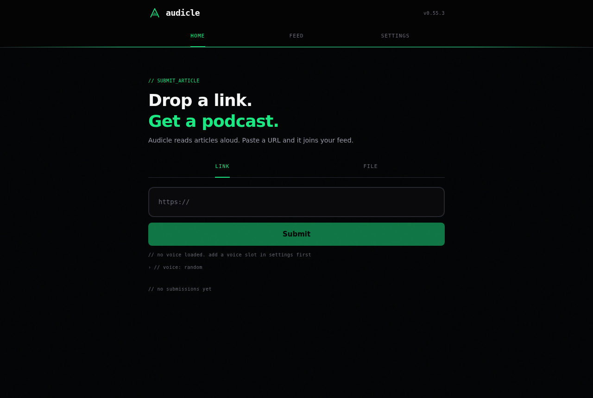
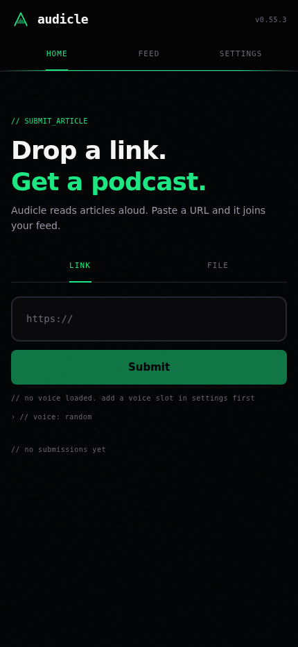
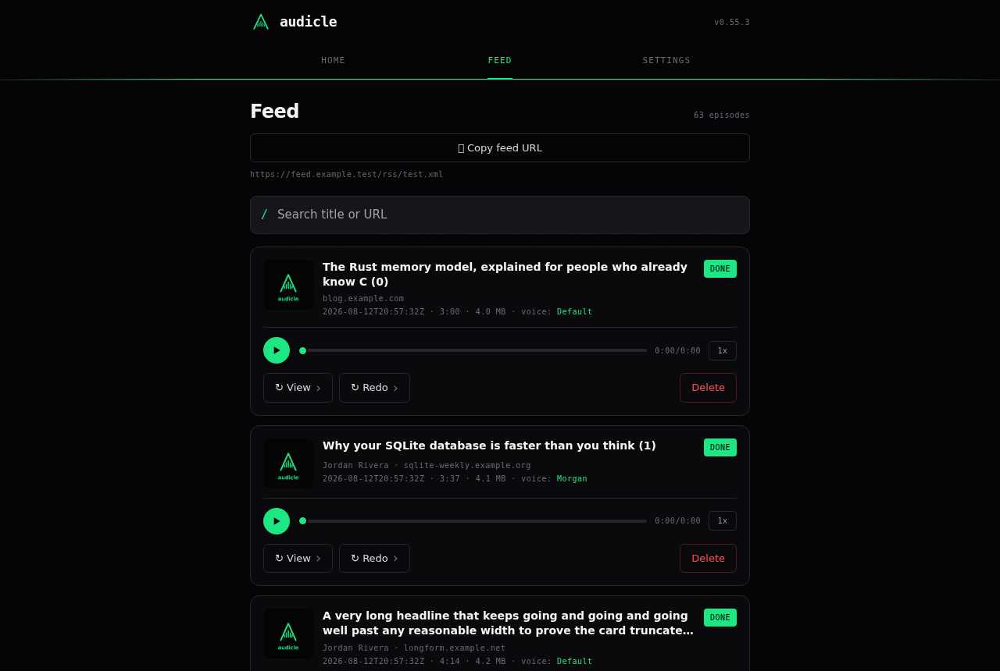
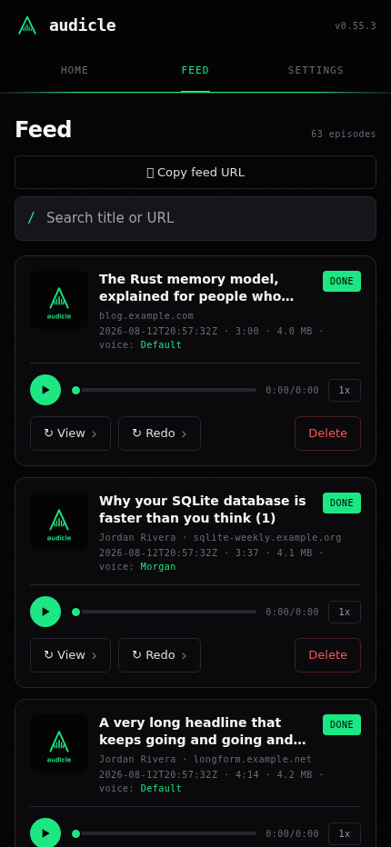
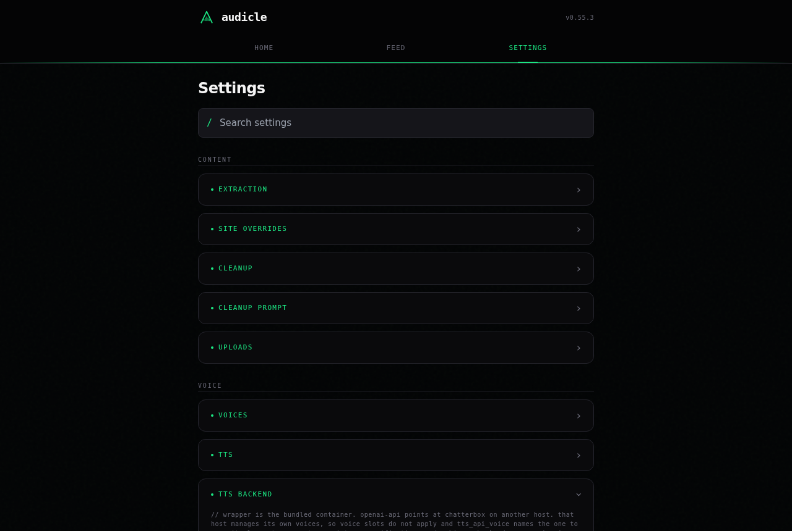
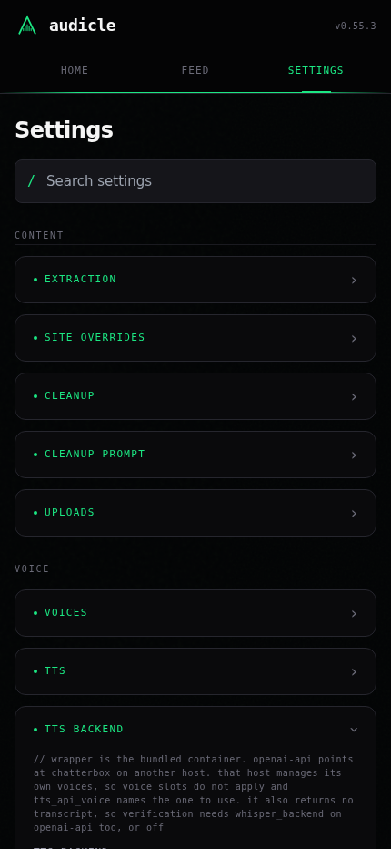

<p align="center">
  
</p>

# Audicle

Self-hosted Podcasting 2.0 service that turns saved articles into a personal podcast feed.

Paste a URL or upload a document (PDF including scanned, DOCX, Markdown, text, HTML, or an image), wait a few minutes, and get an episode with cloned-voice narration, chapters, artwork, an LLM-written episode summary, and a WebVTT transcript. Subscribe in Pocket Casts, Overcast, or Apple Podcasts like any other show.

*Your reading list, as a podcast you own.*

## Contents

- [Why](#why)
- [Screenshots](#screenshots)
- [Sample](#sample)
- [Quickstart](#quickstart)
- [Documentation](#documentation)
- [What's in the repo](#whats-in-the-repo)
- [Development](#development)
- [Licensing notes](#licensing-notes)
- [LLM disclosure](#llm-disclosure)
- [Credits](#credits)

## Why

I read too much, I like my hands free on the go, and the existing article-to-audio tools either lock the audio in their app, charge per minute, or use voices that sound like an airport PA. I wanted something that:

- I control fully
- produces a real podcast feed any podcatcher can subscribe to
- uses my own voice (or any voice I have rights to)
- keeps my reading list private

That's what this is. No GPU? It runs on CPU too, just slower.

## Screenshots

Home: paste a URL or drop files (up to 20 at once), and they join the feed.

<p align="center">
  
  
</p>

Feed: search and page through your episodes, with inline players, transcripts, and per-episode actions.

<p align="center">
  
  
</p>

Settings: everything grouped by subject, searchable as you type.

<p align="center">
  
  
</p>

## Sample

A short clip of cloned-voice narration.

https://github.com/user-attachments/assets/b7dbbcd5-902d-4fed-a2df-32c972f4589f

[Download the MP4](docs/screenshots/sample.mp4)

## Quickstart

You need Docker and docker-compose. The app boots unconfigured: set the LLM provider, feed metadata, and admin password, and upload a reference voice, from the Settings UI after it starts.

```bash
git clone https://github.com/ttlequals0/Audicle && cd Audicle
cp .env.example .env   # compose requires .env to exist; pre-set BASE_URL and any defaults here
docker compose up -d
```

The web UI is at `http://localhost:8000/`, and it installs as a PWA on a phone home screen. The Feed page shows the exact RSS URL to paste into a podcatcher.

Full setup, including CPU-only deployment and file permissions, is in [Installation](docs/installation.md).

## Documentation

The full index is [docs/README.md](docs/README.md). The short version:

| Topic | Covers |
|---|---|
| [How it works](docs/how-it-works.md) | Pipeline from URL to episode, extraction cascade, quality gates |
| [Installation](docs/installation.md) | Requirements, quick start, CPU-only deployment |
| [Web interface](docs/web-interface.md) | Home, Feed, and Settings pages |
| [Configuration](docs/configuration.md) | Every settings category, what saves where |
| [Environment variables](docs/environment-variables.md) | Every variable, runtime-editable ones flagged |
| [Voices and TTS](docs/voices-and-tts.md) | Voice cloning, running Chatterbox or Whisper on other hosts |
| [Paywalled articles](docs/paywalls.md) | What happens when a site serves a teaser instead of the article |
| [Feeds and Podcasting 2.0](docs/feeds-and-podcasting.md) | RSS feed, authenticated feeds, chapters, artwork, retention |
| [API and webhooks](docs/api-and-webhooks.md) | REST surface and episode webhooks |
| [Glossary](docs/glossary.md) | Every term the app uses |
| [Releasing](docs/releasing.md) | Versioning, build, CVE gate, ship |
| [Deployment runbook](docs/DEPLOYMENT.md) | Health checks, logs, rollback, disk |

## What's in the repo

```
backend/        FastAPI app, SQLite, the job pipeline
tts-wrapper/    TTS model server (Chatterbox; separate GPU container)
render/         full-article render sidecar and its restricted egress proxy
frontend/       React + Tailwind operator UI
docs/           documentation and screenshots
data/           runtime artifacts (gitignored: SQLite, MP3, JPG, VTT)
docker-compose.yml
```

## Development

Backend:

```bash
uv sync
uv run pytest                              # 1000+ tests, a few minutes
uv run uvicorn app.main:create_app --factory --reload --app-dir backend
```

Frontend:

```bash
cd frontend && npm install && npm run dev   # Vite, hot reload
```

The `tts-wrapper/` and `render/` packages have their own test suites (`uv run pytest` in each). Lint with `uv run ruff check` from the root; one run covers everything. The OpenAPI schema lives at `openapi.yaml`; regenerate it with `uv run python scripts/dump_openapi.py`.

CodeQL runs on every PR through GitHub's default-setup code scanning (there is no in-repo workflow file for it).

## Licensing notes

The application code is MIT. A few things downstream of it have their own terms:

- **Chatterbox** is the TTS engine. The `chatterbox-tts` library and its model weights are MIT, so there's no non-commercial restriction on the model itself. Every output carries Resemble's inaudible PerTh watermark for provenance, with no flag to turn it off.
- **Wrapper runtime**: the wrapper runs Python 3.11 from `python:3.11-slim`.
  Its GPU image uses the CUDA 12.6 torch wheels and requires a host driver that
  exposes CUDA 12.6 or newer. The backend is separate: Python `>=3.13`, shipped
  on `python:3.14-slim`.

The Audicle name and logo are reserved; see `branding/README.md`.

## LLM disclosure

This project was developed with AI agents as a pair programmer. It was NOT vibe coded. I'm a systems engineer with 15+ years of professional experience; every architecture and design decision here is mine, not the AI's, and every line the LLMs wrote, I reviewed and tested myself.

## Credits

The paywall bypass strategies are inspired by [Ladder](https://github.com/everywall/ladder); see [Paywalled articles](docs/paywalls.md#credit).
