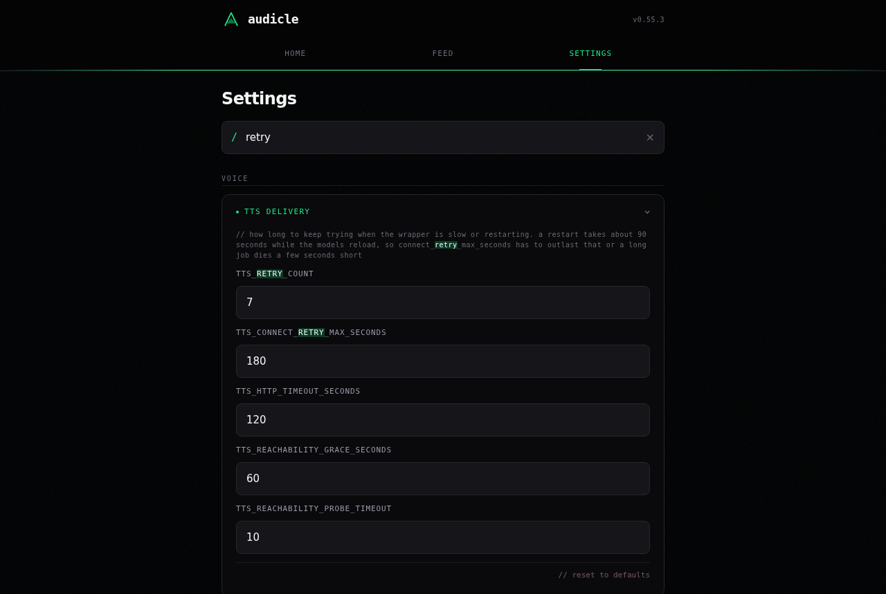

# Web interface

Three pages: Home for submitting, Feed for what you have, Settings for how it behaves. The UI is an installable PWA; on a phone home screen it behaves like an app.

## Home

Paste a URL, or switch to the File tab and drop documents.

  
  

- The file tab takes up to 20 files per batch (PDF including scanned, DOCX, Markdown, text, HTML, or an image). Files upload one at a time, and each becomes its own queued job. One bad file does not sink the batch: an unsupported type or an oversized file is rejected by name at selection, and a duplicate reports "already in the feed" while the rest go through. Failed rows stay in the picker with their reason so you can retry or remove them.
- Each submission picks its narration voice from the picker under the Submit button: Random (a random filled slot), Last used, or a specific slot. See [Voices and TTS](voices-and-tts.md).
- The queue shows running and waiting jobs with per-stage progress; a queued or processing job can be cancelled. Recents lists finished and failed jobs: a failed job can be requeued from here (URL jobs re-fetch, uploads re-run from the stored original), and a finished one can regenerate its chapters without re-synthesizing audio.

## Feed

Your episodes, with inline players, transcripts, and per-episode actions.

  
  

- **Search** covers the whole feed, not the page on screen: it matches episode titles, source URLs, and uploaded filenames as you type. A typed `%` or `_` is literal text, not a wildcard.
- **Pagination** shows 25 episodes per page. The pager appears only when there is more than one page, and deleting the last episode on the last page drops you back a page instead of showing an empty list.
- Per episode: play inline, open the transcript, chapters, or cleaned text, reprocess the whole episode, regenerate chapters alone, or delete it (which also removes its files on disk).
- The copy button at the top holds the exact subscribe URL, key included when [authenticated feeds](feeds-and-podcasting.md#authenticated-feeds) are on.

## Settings

Everything the app does, grouped by subject: Content, Voice, Publishing, Services, System.

  
  

- **Search as you type.** The box at the top filters the page and paints the matching words; matches open themselves so nothing hides behind a collapsed header, and clearing the box restores whatever was open before.

  

- The save bar exists only while there is something to save. Edit a field and a bar slides in at the bottom right with a count of pending changes; save it or undo your edits and it goes away. The sections with their own save buttons (voices, corrections, site overrides, and so on) are unaffected.
- Each generic settings card has a reset control at its foot, clickable only when something in that card differs from the app's shipped defaults. It edits the form rather than saving, so a reset is undoable until you press save.

What each group holds is covered in [Configuration](configuration.md).

[< Docs index](README.md)
